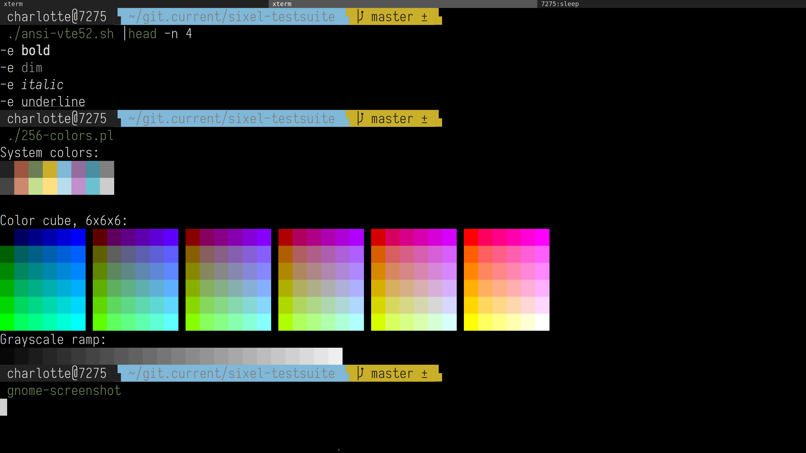
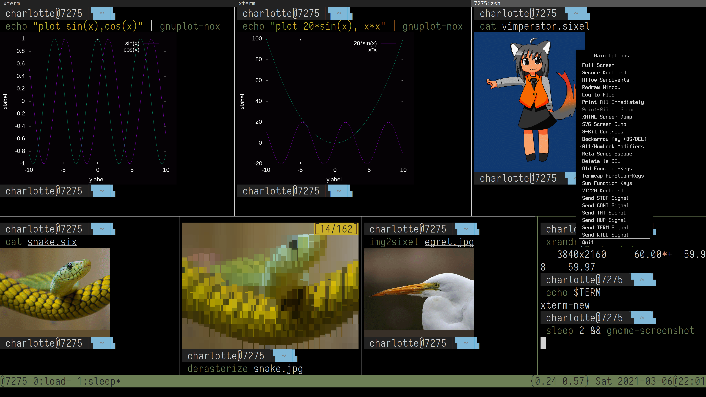

## What is CuteXterm?

CuteXterm is a set of sensible defaults to make the terminal experience on
Linux as good as possible, by adapting xterm to the 21st century.

To be precise, CuteXterm is a set of software (tabbed), fonts (iosevka),
and configuration defaults (Xresources, xinitrc, terminfo, application desktop
file, shell commands) that together make xterm cute and functional.

This way, you can get something like that when you run tmux-sixel inside it:


## What is the difference over say gnome-terminal or even just xterm?

With CuteXterm settings, you will get xterm just as before, but:
 - with sixel graphics,
 - using a modern free software TrueType font that look good even on hi-res displays,
 - with a legible menu that lets you change the font,
 - with Unicode / Dim / Bold / Italics / Underline ANSI text support,
 - with a terminfo and termcap definition advertising that xterm supports all
   the above,
 - with intuitive shortcuts similar to your browser,
 - with various other "sane defaults" which includes things I like, such as
   Solarized colors and consistent shortcuts, and that I believe you will like
   as well

If you don't like my settings, or if your screen is not 4k, you may want to try
the alternative settings provided inside the .Xresources - but to be honest,
they shouldn't matter so much: to me, the core terminal experience is that the
font looks good, the keyboard interactions feel good, and the user interface
doesn't waste too much space.

Also, I've become fond of tabs!

## Wait, xterm supports tabs?

Yes, xterm can be made to support tabs, if you use `tabbed` and a few tweaks to
the file that starts xterm.

tabbed has been changed in config.def.h to use Ctrl for shortcuts and PageUp
PageDown for tabs, adding an extra Shift for key sequences you rarely do like:
 -  Ctrl-Shift-T to open a new tab,
 -  Ctrl-Shift-Q to close a tab,
 -  Ctrl-Shift-PageUp or PageDown to reorder a tab

Ctrl without shift is used with the frequent actions, like:
 - Ctrl-Tab to change tabs,
 - Ctrl-PageUp to go to the next tab,
 - Ctrl-PageDown to go to the previous tab,
 - Ctrl-number to go to the Nth tab

F11 can toggle fullscreen, which is on by default.

## What about xterm shortcuts?

Again, rare actions are done with Ctrl-Shift, like:
 - Ctrl-Shift-B to toggle the scrollbar,
 - Ctrl-Shift-S to lock the scroll while typing,
 - Ctrl-Shift-R to reset the screen (follow that by Ctrl-L if needed to initiate a redraw),
 - Ctrl-Shift-M to maximize, Ctrl-Shift-R to restore (FIXME: this would be better as a toggle),
 - Ctrl-Shift-O to run a script (which I use to open URLs),
 - Ctrl-Shift-H to switch to the alternative screen (like from vim)

For the most frequent actions, Ctrl is used like:
 - Ctrl-Plus to increase the fontsize,
 - Ctrl-Minus to decrease the fontsize,
 - Ctrl-V to paste (with Shift-Ctrl-V and Shift-Insert as slightly different alternatives),
 - Ctrl-C to copy

The copy-paste actions could be improved, but this would require changes to
xterm (like to copy/swap the paste buffers when switching to xterm) which may
not be acceptable to the maintainer.

## Wait, why does Ctrl-C copy?

Because we are in the 21st century!

Using Shift+Ctrl+C to copy is horrible, and a pure torture when switching back
and forth between everything that can copy without pressing the shift key (such
as the browser) and the terminal.

By the way, there is no reason why Ctrl-C couldn't do both copy and send
SIGINTR - it should just be made context-aware, so that it does a copy only if
something is selected (like with the mouse), and send a signal only if nothing
is highlighted.

Yes, I know about select-to-copy - but when I highlight text, I
don't necessarily mean to copy it. And I don't see why I have to adapt my
muscle memory to the terminal, instead of the other way around!

This is possible with some minor configuration tweaks that do not require any
serious change (like what would be required to bring context awareness): the X
key next to C could be used to send SIGINTR, so Ctrl-C always means copy and
Ctrl-X always means SIGINTR.

While we're at it, let's remove Ctrl-Q and Ctrl-S that often accidentally cause
a scroll lock, by disabling flow control with:

	stty intr ^X stop undef start undef rprnt undef discard undef swtch undef -ixoff -ixon

With the above, stty -a doesn't show ^S,^Q,^R and ^O anymore, so you can remap them to your own uses:

```{stty -a}
speed 38400 baud; rows 23; columns 98; line = 0;
intr = ^X; quit = ^\; erase = ^?; kill = ^U; eof = ^D; eol = <undef>; eol2 = <undef>;
swtch = <undef>; start = <undef>; stop = <undef>; susp = ^Z; rprnt = <undef>; werase = ^W;
lnext = ^V; discard = <undef>; min = 1; time = 0;
-parenb -parodd -cmspar cs8 -hupcl -cstopb cread -clocal -crtscts
-ignbrk -brkint -ignpar -parmrk -inpck -istrip -inlcr -igncr icrnl -ixon -ixoff -iuclc -ixany
-imaxbel iutf8
opost -olcuc -ocrnl onlcr -onocr -onlret -ofill -ofdel nl0 cr0 tab0 bs0 vt0 ff0
isig icanon iexten echo echoe echok -echonl -noflsh -xcase -tostop -echoprt echoctl echoke -flusho
-extproc
```

## How to install CuteXterm

Until someone perpare some packages, the installation is manual:
1. Untar iosevka-ss04.tgz in ~/.fonts or /usr/share/font (system-wide deployment)
2. Untar terminfo in.tgz in ~/.terminfo or /usr/share/terminfo (system-wide deployment)
3. Put .xinitrc and .Xresources in ~/ or /etc/skel (system-wide deployment)
4. Put the XDG starter file debian-xterm.desktop in ~/.local/share/applications/ or /usr/share/applications/ (system-wide deployment)
5. Put tabbed/tabbed in /usr/local/bin ideally after recompiling it
6. Install xpropr and xdotool then put at the bottom of your .zshrc or .bashrc:

```{bashrc}
	# No Ctrl-C, instead use Ctrl-X to stop
	stty intr ^X stop undef start undef rprnt undef discard undef swtch undef -ixoff -ixon

	# Remove the terminal titlebar
	[ ${TERM} = "xterm-new" ] && \
	  xprop -id `xdotool getactivewindow` -format _MOTIF_WM_HINTS 32i -set _MOTIF_WM_HINTS 2
```

You are then ready and there's no need to reboot: to load these defaults, simply type:

```{xrdb .Xresources}
	xrdb .Xresources
```

You can then start xterm from your menu.

## Why did you make CuteXterm? (WARNING: LONG RANT)

I'm more of a Windows fan, but recently I've decided to try using Linux on a
laptop- and OMG I was *shocked*! While most people praise Linux, personally I
couldn't believe just how bad the default experience was, in comparison to what
I was using only days before!!

First, I thought it was just a culture shock, then a bad choice of terminal, or a
bad default configuration maybe?

But no, as more weeks went by, and I noticed every terminal emulator I tried
suck, in various degrees, and for a different reason each time, I realized that
it was just how things are on Linux - half assed.

However, as I spend a lot of time in terminals, I had to make do and figure
something that would work.

My first idea was a GPU passthrough to run Windows 10 with low latency. But
that would defeat most of the experience of trying to use Linux. As I was in
the bargaining stage, I thought it could be justified if crucial apps were
missing - but since my favorite browser (Microsoft Edge) is now available on
Linux, meddling with qemu-kvm just to get a good terminal like mintty seemed a
bit overkill.

So I took the time to study the situation, and prepared a acceptable
replacement for my own use, by fixing what could be fixed, at least enough 
that I doesn't make me want to start Windows whenever I need to ssh somewhere.

There are still many warts (like no programming ligatures, changing fonts takes
far too long, there are some weird sixel redraw issues and they are not scaled
when changing fonts) and the copy-paste between the browser and the terminal
could (and WILL!) be improved - but at least I have now have a usable Linux
terminal usable, close to being good enough for my needs

## Wait, I thought people said "Windows sucks"?

LOL sweet summer child!

In my experience, most people who say "Window sucks" are just showoffs who want
geek creds. Millenials seem to have grown up using Linux, so they became
accustomized to the bad terminal experience. And now, in a kind of Stockholm
syndrome, they try to rationalize and justify the bad situation.

But no, even without talking about things that are known to be problematic on
Linux (such as dual screen with different resolutions - let's give Linux a
pass) even in the very basic situation of a laptop with one screen, I'm sorry
but the terminal experience is just *far* better on Windows 10 with mintty than
on Linux: it doesn't just feels snappier and looks better (even if both are
very important), it's just better in every single way, in term of font support,
configurability, etc.

And it's not just mintty that rocks: Microsoft Terminal is also extremely
promising. Once some issues are fixed, and important features added (like
[Sixel Support](https://github.com/microsoft/Terminal/issues/448) which is a
must for me) it may become a worthy contender to mintty thanks to its native
tab support.

## I disagree for reason X, Y and Z

Good for you!

## I agree, what did you find to be the least worst options on Linux?

You may think about kitty, alacritty, etc. but mlterm and xterm are the
only ones worth using if you can't compromise either on essential features
(for me, sixel support) or performance ([the most important is
latency](https://danluu.com/term-latency/) which [has been studied in
depth](https://lwn.net/Articles/751763/))

Eventually, I settled on xterm, simply because I found it more versatile that
mlterm, with a good enough latency. And when properly configured, xterm is not
too painful to use: it can get out of the way. By that, I mean I can forget
what I'm using and the limitations of my tools, and concentrate instead on what
I'm doing.

Every single other terminal I've tried just isn't as good: the rare ones that
are not a pure waste of time and can support the comparison with xterm suffer
from a high latency, or a larger memory footprint, or both (!!), while only
offering a mere fraction of xterm features.

Don't expect any miracle: even when it's well configured, xterm still pales
in comparison of mintty - in a day-to-day use, what I miss the most is the
support for programming ligatures, but if you look deeper, it's death by a
thousand papercuts - like the slow redraw of sixels that sometimes happen.

Yet in 2021, xterm seems to be the best overall choice if you spend a lot of
time in the console on Linux. So CuteXterm tries to do the best with it.
